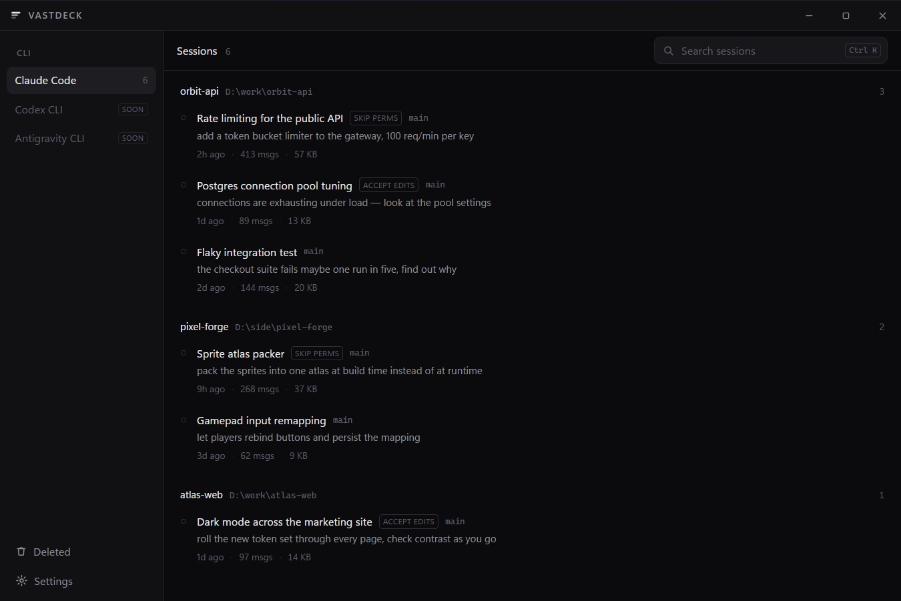

<div align="center">


# Vastdeck

**Every AI CLI session from every workspace on your machine, in one window.**

Reopen one in a terminal, see which are running, delete the ones you are done
with — and get them back if you change your mind.

Claude Code today · Codex and Antigravity next

Windows · [Tauri 2](https://tauri.app) · MIT



</div>

---

## Why

AI coding CLIs keep every conversation on disk, one file per session, in a
folder named after the workspace. After a few months that is hundreds of files
across dozens of projects, and the only way back into one is a resume command
run from inside the right directory — which means remembering which directory
that was.

Vastdeck reads those folders and shows you the whole thing: what the session was
about, where it lives, when you last touched it, whether it is running right
now. One click reopens it in a terminal.

Claude Code is the CLI it reads today. The provider layer is a Rust trait, so
Codex CLI and Antigravity CLI are additions rather than rewrites.

## What it does

- **Every session, grouped by workspace** — title, last prompt, path, age, size,
  message count, and what the workspace has cost you.
- **Live status** — sessions currently running are marked idle or busy, read
  from the CLI's own registry. Clicking one raises its terminal instead of
  starting a second process on the same transcript.
- **Five ways to reopen** — plain resume, skip permissions, accept edits, plan
  mode, or fork. Shift-click and Alt-click as shortcuts.
- **Reversible delete** — deleted sessions move to a backup folder and stay in a
  Deleted view until you purge them. Permanent delete is opt-in.
- **Fuzzy search** across titles, prompts, and paths.
- **Tray and startup** — close to the notification area, launch at login.
- **Fast on a large history** — 400 MB of transcripts list in well under a
  second. See [How it works](#how-it-works).

## Install

From [Releases](../../releases), Windows 10/11 x64:

| Download | |
|---|---|
| **`Vastdeck_x.y.z_x64-setup.exe`** | Installer. No admin rights needed — it installs for your user only. Start-menu entry and an uninstaller. |
| **`Vastdeck_x.y.z_x64_portable.zip`** | One folder, nothing installed. Unzip and run. |
| `Vastdeck_x.y.z_x64_en-US.msi` | For deploying through group policy. Needs admin. |

All three are unsigned, so Windows SmartScreen will warn the first time. *More
info → Run anyway*, or check the SHA-256 against the release notes if you would
rather verify it yourself.

You also need [Claude Code](https://claude.com/claude-code); Vastdeck finds
`claude` on your `PATH`, or you can point at it in Settings.

### Updating

Settings → System shows the version you are on and checks this repository for a
newer one. An installed copy downloads the installer, verifies it against a
signing key compiled into the build, and runs it — nothing installs unless that
signature matches.

Portable copies are not updated in place: the updater works by running an
installer and a portable folder has nothing to install into, so it offers the
release page instead.

### Portable mode

The portable zip contains a `portable.txt` beside the executable. That file is
the switch: with it present, settings, the session cache and launch scripts live
in `data\` next to `vastdeck.exe` instead of `%LOCALAPPDATA%`. Delete the folder
and nothing of Vastdeck's is left on the machine.

Remove `portable.txt` and it behaves like the installed build. If the folder
holding the executable turns out not to be writable — a read-only share, a
mounted image — it falls back to `%LOCALAPPDATA%` rather than refusing to start.
Settings shows which of the two is in use.

### Build from source

```bash
git clone https://github.com/orbz22/vastdeck.git
cd vastdeck
npm install
npm run app          # dev build with hot reload
npm run app:build    # installers in src-tauri/target/release/bundle
```

Requires Rust (msvc toolchain), Node 20+, and the WebView2 runtime, which ships
with Windows 11.

## Privacy

Vastdeck reads and writes files in your own Claude Code directory and nothing
else. There is no telemetry, no account, no network call — the app makes no
outbound requests at all. Your conversations never leave the machine.

## How it works

No daemon, no index, no database of its own. The Claude Code data directory *is*
the database.

| Source | Used for |
|---|---|
| `~/.claude/projects/<encoded-cwd>/<sessionId>.jsonl` | one file per session |
| `~/.claude/sessions/<pid>.json` | which sessions are running right now |
| `~/.claude.json` → `projects[cwd]` | per-workspace cost and line counts |

Two details shape the design.

**Folder names are lossy.** `C:\Work Projects (2026)\.config\my-app` is stored
as `C--Work-Projects--2026---config-my-app`; spaces, dots, parentheses and
separators all collapse to `-`, so the real path can only come from the `cwd`
field inside the transcript.

**Transcripts get large.** On the machine this was built against: 400 MB across
86 files, the biggest 18 MB. None is ever parsed end to end — a 64 KB head
window yields `cwd`, `version` and `gitBranch`, a 128 KB tail window yields the
latest `ai-title`, `last-prompt` and `permission-mode`, and the file's own mtime
and size supply the rest. Results are cached per `(path, mtime, size)`.

```
86 files / 398 MB -> 62 sessions | cold 70ms | warm 12ms
```

(debug build, `cargo test -- --nocapture`; cold timing varies with the OS file
cache)

Message counts do need every byte, so they run as a separate pass after the list
is already interactive, and are cached alongside the rest.

### Launch modes

| Mode | Command |
|---|---|
| Resume | `claude --resume <id>` |
| Skip permissions | `claude --resume <id> --dangerously-skip-permissions` |
| Accept edits | `claude --resume <id> --permission-mode acceptEdits` |
| Plan | `claude --resume <id> --permission-mode plan` |
| Fork | `claude --resume <id> --fork-session` |

Shift-click a row for skip permissions, Alt-click to fork. The last mode used
for a session becomes its default next time.

Skip permissions is never what a plain click does unless you set it as the
default, and the first use in any workspace asks once before it is remembered.

### Terminal quoting

Workspace paths contain spaces and parentheses, and Windows Terminal treats `;`
as a command separator, so nothing is nested inside the `wt` command line. Each
launch writes a small script into Vastdeck's own data folder — a path with
neither spaces nor semicolons — that does the `cd` and the `claude` call itself,
and the terminal is handed only that path. Fallback order is Windows Terminal →
pwsh → powershell → cmd.

With Windows Terminal, **A session opens as** decides between a tab in the
current window (`wt -w 0 new-tab …`) and a window of its own (`wt new-tab …`).

### Deleting

A soft delete moves the transcript to
`~/.claude/backups/vastdeck/<timestamp>-<id>/` along with a `vastdeck.json`
manifest recording where it came from — without that the folder it belongs to
cannot be reconstructed, because the encoding is lossy. The **Deleted** view
lists everything in that folder and can put any of it back or remove it for
good. Permanent delete skips the backup entirely and is opt-in in Settings.

### Tray and startup

**Close to the system tray** turns closing into a hide: the window disappears
but Vastdeck keeps running behind a notification-area icon. Left-click it to
bring the window back, right-click for **Quit Vastdeck** — the only way to
actually exit while the setting is on. Minimize is untouched. The interception
lives in the Rust `CloseRequested` handler rather than in the close button, so
Alt+F4 behaves identically. Windows 11 files a new tray icon under the
hidden-icons chevron until you drag it onto the taskbar yourself.

**Start with Windows** writes Vastdeck into
`HKCU\Software\Microsoft\Windows\CurrentVersion\Run` with an `--autostart` flag.
With close-to-tray also on, that login launch stays in the notification area —
the window is created hidden and only shown when the launch was not an
autostart, so nothing flashes on screen.

That key stores an absolute path, which matters most for the portable build:
move the executable and Windows goes on pointing at a file that is no longer
there, failing at login with nothing on screen to say so, while the setting
still reads as on. So every start re-writes the key to name the executable that
is actually running.

### Notes for anyone hacking on it

Three Windows details cost real time to find, so they are worth stating plainly:

- `data-tauri-drag-region` must not wrap the window buttons. Tauri swallows
  `mousedown` anywhere inside a drag-region subtree to begin moving the window,
  so a button nested under one never receives its click and silently does
  nothing. Only the left-hand strip carries the attribute.
- Removing a tray icon has to run on the event-loop thread. From a worker
  thread the Win32 call behind it is ignored without error, leaving a dead icon
  in the notification area until the process exits.
- Only one copy may run at a time, hence `tauri-plugin-single-instance`
  registered before every other plugin. Two copies each hold their own settings
  in memory and the last one to save wins, quietly resurrecting values the other
  had changed — besides fighting over the tray icon and the Run key.

## Layout

```
src-tauri/src/
  scanner.rs    head+tail parsing, parallel scan, disk cache
  registry.rs   live sessions, validated against real processes
  launcher.rs   script generation and the terminal fallback chain
  deleter.rs    soft delete, restore, purge
  tray.rs       notification-area icon
  winproc.rs    pid liveness and raising a terminal window
src/
  components/   TitleBar, Sidebar, SessionRow, DeletedList, SettingsPanel
  lib/          typed command wrappers and formatting
```

Run the tests with `cd src-tauri && cargo test`. The scanner test runs against
whatever is in your own `~/.claude` and skips cleanly if there is nothing there.

Releases are built with `npm run app:release`, which produces the installers, the
portable zip, and `latest.json`. That last step needs the updater signing key:

```powershell
$env:TAURI_SIGNING_PRIVATE_KEY_PATH = "path\to\updater.key"
npm run app:release
```

Without the key the build still succeeds but produces no `.sig`, and
`make-latest-json.mjs` refuses rather than publishing an update nobody can
install. The public half of the pair lives in `tauri.conf.json`; the private half
must never reach the repository, because anyone holding it can push an update to
every user.

`CLAUDE_CONFIG_DIR` overrides which directory Vastdeck reads, which is the way
to work on it — or take a screenshot — without your own conversations on screen:

```powershell
$env:CLAUDE_CONFIG_DIR = "C:\tmp\demo\.claude"; .\vastdeck.exe
```

## Contributing

Issues and pull requests are welcome. Adding a CLI provider means implementing
the `CliProvider` trait in `src-tauri/src/providers/` — session discovery,
launch arguments, and deletion — and the rest of the app picks it up.

Please keep changes to the terminal-spawning and deletion paths covered by
tests; both touch things that are hard to undo.

## License

[MIT](LICENSE)

---

Vastdeck is an independent project. It is not affiliated with, endorsed by, or
supported by Anthropic. "Claude" and "Claude Code" are trademarks of Anthropic.
